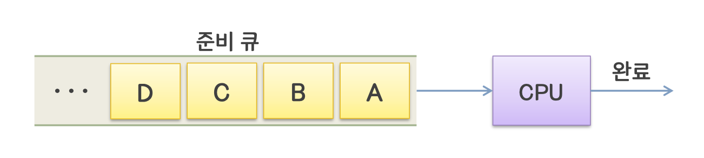
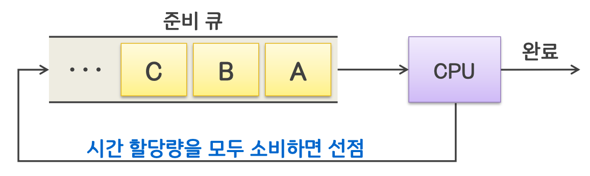

## 3. 스케줄링 알고리즘(Scheduling Algorithm)

### 스케줄링 성능 평가 기준

일반적으로 스케줄링 알고리즘의 성능을 평가하는 데 평균 대기시간과 평균 반환시간이 이용됨

- 평균 대기시간(Average Waiting Time)  
  : 각 프로세스가 수행이 완료될 때까지 준비 큐에서 기다리는 시간의 합의 평균값

- 평균 반환시간(Average Turnaround Time)  
  : 각 프로세스가 생성된 시점부터 수행이 완료된 시점까지의 소요 시간의 평균값

<예제>

- A는 0의 시간에 준비 큐에 삽입. 2의 시간에 큐에서 나와 CPU에 할당되었기에 **A의 대기시간은 (할당된 시간 2 - 큐 삽입 시간 0 = 2).**  
  A의 프로세스 실행이 끝난 시간은 5.
  **A의 반환시간은 (실행 끝난 시간 5 - 큐 삽입 시간 0 = 5)**

- B는 1의 시간에 준비 큐에 삽입. A 프로세스가 끝난 시간인 5의 시간에 B는 CPU에 할당되었기에 B의 할당된 시간은 5.  
  **B의 대기시간은 (할당된 시간 5 - 큐 삽입 시간 1 = 4).**  
  B의 프로세스 실행이 끝난 시간은 9.  
  **B의 반환시간은 (실행 끝난 시간 9 - 큐 삽입 시간 1 = 8)**

두 프로세스의 평균 대기시간은 (2+4)/2=3  
평균 반환시간은 (5+8)/2=6.5

### 다양한 스케줄링 알고리즘

#### FCFS(First-Come First-Served) 스케줄링

- 비선점 스케줄링 알고리즘
- 준비 큐에 도착한 순서에 따라 디스패치

- 장점

  - 스케줄링 알고리즘 중 가장 간단한 기법

- 단점

  - 짧은 프로세스가 긴 프로세스를 기다리거나, 중요한 프로세스가 나중에 수행될 수 있음
  - 프로세스들의 도착 순서에 따라 평균 반환시간이 크게 변함

#### SJF(Shortest Job First) 스케줄링

- 비선점 스케줄링 알고리즘
- 준비 큐에서 기다리는 프로세스 중 실행시간이 가장 짧다고 예상된 것을 먼저 디스패치

- 장점

  - 일괄처리 환경에서 구현하기 쉬움

- 단점

  - 실행 예정 시간 길이를 사용자의 추정치의 의존하기 때문에 실제로는 먼저 처리할 작업의 CPU 시간을 예상할 수 없음

#### SRT(Shortest Remaining Time) 스케줄링

- 선점 스케줄링 알고리즘
- 실행이 끝날 때까지 남은 시간 추정치가 가장 짧은 프로세스를 먼저 디스패치

- 장점

  - SJF보다 평균 대기시간이나 평균 반환시간에서 효율적
  - 대화형 운영체제에 유용

- 단점

  - 각 프로세스의 실행시간 추적, 선점을 위한 문맥 교환 등 SJF보다 오버헤드가 큼

#### RR(Round Robin) 스케줄링

- 선점 스케줄링 알고리즘
- 준비 큐에 도착한 순서에 따라 디스패치 하지만, **정해진 시간 할당량**에 의해 실행을 제한
- 시간 할당량 안에 완료되지 못한 프로세스는 준비 큐의 맨 뒤에 배치

- 장점

  - CPU를 독점하지 않고 공평하게 이용
  - 대화형 운영체제에 유용

- 단점

  - 시간 할당량이 너무 크면 FCFS 스케줄링과 같아짐
  - 시간 할당량이 너무 작으면 문맥 교환에 따른 오버헤드가 크게 증가함

#### HRN(Highest Response Ratio Next) 스케줄링

- 비선점 스케줄링 알고리즘
- 준비 큐에서 기다리는 프로세스 중 응답비율이 가장 큰 것을 먼저 디스패치
- 예상 실행시간이 짧을수록, 대기시간이 길수록 응답비율이 커짐
- 장점: SJF의 단점을 보완

#### 다단계 피드백 큐 스케줄링

- 선점 스케줄링 알고리즘
- I/O 중심 프로세스와 CPU 중심 프로세스의 특성에 따라 서로 다른 시간 할당량 부여
- n개의 단계(단계 1 ~ 단계 n)
- 각 단계마다 하나씩의 큐 존재
- 단계가 커질수록 시간 할당량도 커짐

- 스케줄링 방법

  - 신규 프로세스는 단계 1의 큐에서 FIFO(First-In First-Out) 순서에 따라 CPU 점유
  - 입출력 같은 이벤트가 발생하면 CPU를 양보하고 대기상태로 갔다가 다시 준비상태가 될 때에는 현재와 동일한 단계의 큐에 배치
  - 시간 할당량을 다 썼지만 프로세스가 종료되지 못했다면 다음 단계의 큐로 이동 배치
  - 마지막 단계 n에서는 RR 스케줄링 방식으로 동작
  - 단계 k의 큐에 있는 프로세스가 CPU를 할당받으려면 단계 1부터 단계 k-1까지 모든 큐가 비어있어야만 함

- 장점

  - I/O위주의 프로세스(대화형)는 높은 우선권 유지
  - 연산 위주의 CPU 중심 프로세스는 낮은 우선권이지만 기 시간 할당량 가짐

- 적응적 다단계 피드백 큐 스케줄링

  - 시간 할당량을 다 쓰기 전에 CPU를 반납하는 경우, 하나 작은 단계의 큐로 이동 배치
  - 연산 위주의 프로세스가 I/O 위주로 바뀐다면 점점 작은 단계로 배치 가능
