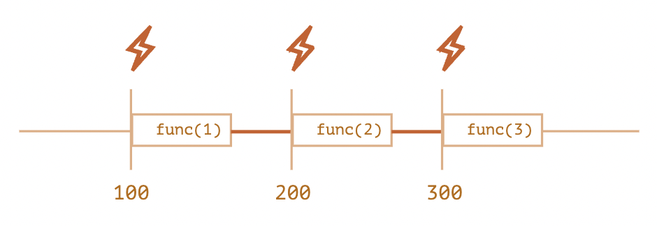
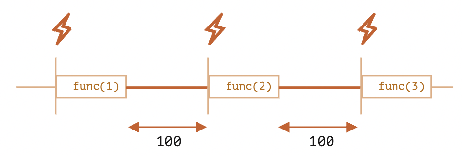

일정 시간이 지난 후에 원하는 함수를 예약 실행(호출)할 수 있게 하는 것을 **'호출 스케줄링(scheduling a call)'**이라고 합니다.  
자바스크립트 명세서에는 `setTimeout`과 `setInterval`이 명시되어 있지는 않지만, 브라우저와 `node.js`를 포함한 Javascript 호스트 환경 대부분이 지원합니다.

### setTimeout

#### setTimeout 문법(Syntax)

```Javascript
let timerId = setTimeout(func|code, [delay], [arg1], [arg2], ...);
```

#### setTimeout 매개변수(Parameter)

`func|code`

- 실행하고자 하는 코드로, 함수 또는 문자열 형태입니다. 보통 이 자리엔 **함수**가 들어가며 문자열도 들어가지만 추천되지 않습니다.

`delay`

- 실행 전 대기 시간으로, 단위는 밀리초(millisecond, 1000밀리초 = 1초)이며 기본 값은 0입니다.

`arg1, arg2`...

- 함수에 전달할 인자들(arguments). IE9 이하에서는 지원되지 않습니다.

#### setTimeout 사용 예시

- 인자없는 함수

```Javascript
function sayHello() {
  alert('Hello!')
}

setTimeout(sayHello, 1000); // 1초 뒤에 sayHello()를 실행시킴
```

- 인자 있는 함수

```Javascript
function sayHello(name) {
  alert('Hello ' + name + '!')
}

setTimeout(sayHello, 1000, 'eun'); // Hello eun!
```

`sayHello` 함수의 매개변수(Parameter) 인자로 `eun`을 넘기고 실행했습니다.

### clearTimeout으로 스케줄링 취소하기

- `setTimeout`을 호출하면 **'타이머 식별자(timer identifier)'**가 반환됩니다. 즉, `setTimeout`의 `timerId`를 반환합니다.
- 스케줄링을 취소하기 위해서는 `clearTimeout` 함수를 사용합니다.

```Javascript
// 기본 문법
let timerId = setTimeout(...);
clearTimeout(timerId);
```

```Javascript
// 사용 예시
let timerId = setTimeout(() => alert("아무런 일도 일어나지 않습니다."), 1000);
alert(timerId); // 타이머 식별자

clearTimeout(timerId);
alert(timerId); // 위 타이머 식별자와 동일함 (취소 후에도 식별자의 값은 null이 되지 않습니다.)
```

코드를 실행해보면 타이밍 식별자가 숫자라는 걸 알 수 있고, `clearTimeout`으로 스케줄링이 취소된 것을 확인할 수 있습니다.

### setInterval

`setInterval` 메소드는 `setTimeout`과 동일한 문법을 사용합니다.

```Javascript
let timerId = setInterval(func|code, [delay], [arg1], [arg2], ...);
```

- 인자 역시 동일합니다. 다만, `setTimeout`은 함수를 **단 한번만 실행**하지만, `setInterval`은 함수를 **주기적으로 실행**하게 만듭니다.

- 함수 호출을 중단하기 위해서는 `clearInterval(timerId)`을 사용하면 됩니다.

```Javascript
// 2초 간격으로 메시지를 보여줌
let timeId = setInterval(() => alert('똑딱똑딱'), 2000);

// 5초 후에 정지
setTimeout(() => { clearInterval(timeId); alert('시계 밥 주세여'); }, 6000);
```

### 중첩 setTimeout

함수를 주기적으로 실행하는 방법은 `setInterval` 함수 이외에도 중첩 `setTimeout`을 사용할 수 있습니다.

```Javascript
/* setInterval을 이용하지 않고 아래와 같이 중첩 setTimeout을 사용함
let timerId = setInterval(() => alert('째깍'), 2000); */

let timerId = setTimeout(function tick() {
  alert('째깍');
  timerId = setTimeout(tick, 2000); // (*)
}, 2000);
```

중첩 `setTimeout`은 `setInterval` 보다 유연하게 작동됩니다. 호출 결과에 따라 다음 호출을 원하는 방식으로 조정해 스케줄링할 수 있기 때문입니다.

5초 간격으로 서버에 요청을 보내 데이터를 얻는다고 가정해봅시다. 과도한 요청으로 인해 서버가 과부하 상태가 된다면 요청 간격을 증가시켜주는 것이 좋을 겁니다.

```Javascript
let delay = 5000;

let timerId = setTimeout(function request() {
  ...요청 보내기...

  if (서버 과부하로 인한 요청 실패) {
    // 요청 간격을 늘립니다.
    delay *= 2;
  }

  timerId = setTimeout(request, delay);

}, delay);
```

이 방법은 CPU 소모가 많은 작업을 주기적으로 실행하는 경우에도 유용합니다. 다음 작업을 유동적으로 계획할 수 있기 때문입니다.

**중첩 `setTimeout`을 이용하는 방법은 지연 간격을 보장하지만 `setInterval`은 이를 보장하지 않습니다.**

첫 번째 예시. `setInterval` 사용

```Javascript
let i = 1;
setInterval(function() {
  func(i++);
}, 100);
```

두 번째 예시. `setTimeout` 사용

```Javascript
let i = 1;
setTimeout(function run() {
  func(i++);
  setTimeout(run, 100);
}, 100);
```



setInterval을 사용할 경우 내부 스케줄러가 `func(i++)`을 100ms마다 실행합니다.



함수와 함수의 실행사이의 빈 선이 지연시간입니다.  
`setInterval`과 `setTimeout`의 지연시간이 다르게 나오고 있습니다.
**즉, `setInterval`을 사용하면 `func` 함수 호출 사이의 지연 간격이 실제 명시한 간격인 100ms 보다 짧아지게 됩니다.**  
이는 `func`을 실행하는데 **소모되는** 시간도 지연 간격에 포함시키기 때문입니다.

만약 `func`을 실행하는데 걸리는 시간이 명시된 지연 간격인 100ms보다 더 길다면 엔진은 `func`이 종료될 때까지 기다렸다가 스케줄러를 확인 후 지연 시간이 오버됐으면 다음 호출을 바로 시작합니다.

**중첩 `setTimeout`을 사용한 경우 명시된 지연 시간(100ms)이 보장됩니다.**  
이전 함수의 실행이 종료된 이후에 다음 함수 호출에 대한 계획이 세워지기 때문입니다.

### 대기 시간이 0인 setTimeout

`setTimeout(func, 0)`이나 `setTimeout(func)`을 사용하면 `setTimeout`의 대기시간을 0으로 설정할 수 있습니다.

대기 시간이 0으로 설정되면 `func`을 가능한 한 빨리 실행할 수 있게 됩니다. 단, 이때 스케줄러는 현재 실행 중인 스케줄 처리가 종료된 이후에 스케줄링한 함수를 실행합니다.  
이런 특징을 이용해 현 스케줄이 종료된 직후 원하는 함수를 실행할 수 있도록 할 수 있습니다.

```Javascript
setTimeout(() => console.log("World"));

console.log("Hello");
```

위 코드는 콘솔에 `Hello`가 먼저 출력된 후 `World`가 출력됩니다.  
`World`를 출력하는 함수는 대기시간 0을 가져 바로 **메시지 큐**로 전달됩니다.  
이후 콘솔에 `Hello`가 출력되는 함수가 **콜 스택**에 추가되고 이 함수가 먼저 실행됩니다.
이후 **이벤트 루프**가 **콜 스택**이 비어있는 것을 확인한 후 **메시지 큐**에 담겨있던 `World` 출력 함수를 **콜 스택**에 추가합니다. 그 후 `World` 함수가 실행되게 됩니다.

### requestAnimationFrame

Javascript에서 애니메이션을 구현하기 위한 방법으로는 `new Date()`를 사용한 타이머를 이용할 수 있습니다. 이는 애니메이션의 시작 지점과 종료 시점을 변수에 저장해 반복적으로 실행하는 방법입니다.  
하지만, 이 방법은 콜 스택이 지나치게 많다는 단점이 있습니다.  
이때 `requestAnimationFrame()` 함수가 필요합니다.

`requestAnimationFrame` 함수는 반복할 함수를 인자로 받습니다.
`requestAnimationFrame` 함수의 장점

- 백그라운드 동작 및 비활성화 시 중지
- 최대 1ms로 제한되며 1초에 60번 동작
- 다수의 애니메이션에도 동일한 타이머를 참조

```Javascript
// requestAnimationFrame 예시

!(function() {
  let start = new Date().getTime()
  let i = 1
  let counting = function() {
    let ts = new Date().getTime()
    if (ts - 1000 > start) {
      // console.log('End');
    } else {
      console.log(i++, ts)
      requestAnimationFrame(counting)
    }
  }
  requestAnimationFrame(counting)
})()
```

위 코드는 1초 동안 `counting` 함수가 60번까지만 실행되고 종료됩니다.  
따라서 콜 스택이 많아지는 현상을 방지할 수 있습니다.

`requestAnimationFrame` 함수를 취소하기 위해서는 `cancelAnimationFrame` 함수가 사용됩니다.

```Javascript
let requestId = requestAnimationFrame(() => console.log('Hello World!'))
cancelAnimationFrame(requestId)
```

참고자료: https://ko.javascript.info/settimeout-setinterval
