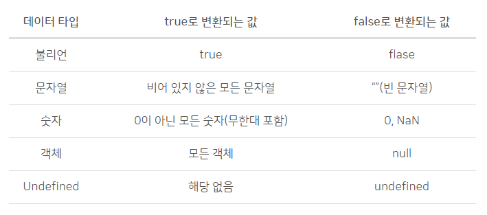

## 원시 자료형(Primitive Types)

자바스크립트에서 원시 자료형(primitive)이란 객체가 아니면서 메서드도 가지지 않는 데이터.
대부분의 경우, 원시 값은 언어 구현체의 가장 저급한(low level) 단계에서 나타남.
모든 원시 값은 불변하여 변형할 수 없음. 원시 값 자체와, 원시값을 할당한 변수를 혼동하지 않는 것이 중요함. 변수는 새로운 값을 다시 할당할 수 있지만, 이미 생성한 원시 값은 객체, 배열, 함수와는 달리 변형할 수 없음.

<예제1> <br />
다음 예제는 원시 값이 불변함을 이해할 때 도움이 됨.

```javascript
// 문자열 메서드는 문자열을 변형하지 않음
var bar = "baz";
console.log(bar); // baz
bar.toUpperCase();
console.log(bar); // baz

// 배열 메소드는 배열을 변형함
var foo = [];
console.log(foo); // []
foo.push("plugh");
console.log(foo); // ["plugh"]

// 할당은 원시 값에 새로운 값을 부여 (변형이 아님)
bar = bar.toUpperCase(); // BAZ
Copy to Clipboard
원시 값을 교체할 수는 있지만, 직접 변형할 수는 없음.
```

<예제2>

```javascript
// 원시 값
let foo = 5;

// 원시 값을 변경해야 하는 함수 정의
function addTwo(num) {
  num += 2;
}
// 같은 작업을 시도하는 다른 함수
function addTwo_v2(foo) {
  foo += 2;
}

// 원시 값을 인수로 전달해 첫 번째 함수를 호출
addTwo(foo);
// 현재 원시 값 반환
console.log(foo); // 5

// 두 번째 함수로 다시 시도
addTwo_v2(foo);
console.log(foo); // 5
```

### 1. String

JavaScript의 String 타입은 텍스트 데이터를 나타낼 때 사용함. String은 16비트 부호 없는 정수 값 "요소"로 구성된 집합으로, 각각의 요소가 String의 한 자리를 차지함. 첫 번째 요소는 인덱스 0에, 그 다음 요소는 인덱스 1, 그 다음은 2, ... 이런식으로. String의 길이는 그 안의 요소 수와 같음.

16비트 유니코드 문자셋(UTF-16)으로 구성된 문자열 됐으며,

- 작은따옴표(''), 큰따옴표(""), 템플릿 리터럴(``)으로 문자열을 할당할 수 있다.
- 특히, ES6부터 도입된 템플릿 리터럴을 이용하면, 줄바꿈이나 공백이 모두 적용된다.

### 2. Number

ECMAScript는 Number와 BigInt 두 가지의 내장 숫자 타입을 가지고 있음.
Number는 64비트 부동소수점 형식으로, 모든 숫자를 실수로 처리한다.

```javascript
var num_01 = 10; // 정수도 실수로 처리한다.
var num_02 = -10.05; // 실수
var num_03 = 10 / 0; // +Infinity
var num_04 = 10 / -0; // -Infinity
var num_05 = 1 * 'str'; // NaN
console.log(typeof num_01); // number
```

### 3. BigInt

BigInt 타입은 임의 정밀도로 정수를 나타낼 수 있는 JavaScript 숫자 원시 값. BigInt를 Number의 안전 한계를 넘어서는 큰 정수도 안전하게 저장하고 연산할 수 있음.

BigInt는 정수 끝에 n을 추가하거나 생성자를 호출해 생성할 수 있음.

Number의 안전 한계는 Number.MAX_SAFE_INTEGER로 알아볼 수 있음. BigInt의 도입 이후로는 이 한계를 넘는 숫자에 대해 계산이 가능함.

다음 예제는 Number.MAX_SAFE_INTEGER 밖으로 나가는 정수에서도 예상된 값을 반환하는 것을 보임.

```javascript
> const x = 2n ** 53n;
> 9007199254740992n
> const y = x + 1n;
> 9007199254740993n
```

> +, \*, -, \*\*, % 연산자를 Number에 사용하듯 BigInt에서도 사용할 수 있음. BigInt는 Number와 엄격하게 같지는 않지만 유사.

BigInt는 if, ||, &&, Boolean, !처럼 불리언 변환이 발생하는 곳에서는 Number처럼 동작함.

BigInt는 Number와 혼합해 연산할 수 없으며, 이때 TypeError가 발생함.

### 4. Boolean



컴퓨터 과학에서, 불린(boolean)은 논리적인 데이터 유형. 불린은 참(true) 혹은 거짓(false) 값만을 가질 수 있음. 자바스크립트에서 불린 조건은 어떤 코드 부문이 실행되어야 할 지(예를 들어 if 절 안에서) 또는 어떤 코드 부문을 반복해야 할지(예를 들어 for 문 안에서) 결정하는 데 쓰임.
이처럼 Boolean 타입은 주로 조건문에 자주 사용하며 **0, -0, null, false, NaN, undefined, 빈 문자열 ("")은 false**로 간주된다. 문자열 "false"를 포함한 그 외 모든 다른 값은 **초기값을 true로** 설정한다.

아래는 불린이 쓰일 수 있는 예시를 보여주는 유사코드(실행 가능한 코드가 아님).

```javascript
**_JavaScript if Statement_**
if(boolean conditional) {
//coding
}

if(true) {
console.log("boolean conditional resolved to true");
} else {
console.log("boolean conditional resolved to false");
}


**_JavaScript for Loop_**
for(control variable; boolean conditional; counter) {
//coding
}

for(var i=0; i<4; i++) {
console.log("I print only when the boolean conditional is true");
}
```

### 5. Symbol

심볼은 ES6에서 새롭게 추가된 타입으로 변경 불가능한 원시 타입의 값이다.<br />
심볼은 주로 **이름의 충돌 위험이 없는 유일한 객체의 Property Key를 만들기 위해 사용**한다.

```javascript
// 심볼 key는 이름의 충돌 위험이 없는 유일한 객체의 프로퍼티 키
var key = Symbol('key');
console.log(typeof key); // symbol

var obj = {};
obj[key] = 'value';
console.log(obj[key]); // value
```

### 6. undefined

선언 이후 값을 할당하지 않은 변수는 undefined 값을 가짐. **어떤 변수를 만들고 그 값을 정의해주지 않았을때나 존재하지 않는 객체 프로퍼티**에 접근할 경우 undefined가 반환됨

```javascript
var x; // 값을 할당하지 않고 변수 선언

console.log("x's value is", x); // "x's value is undefined" 출력
```

#### null vs undefined 용도의 차이

undefined는 단어의 의미 그대로 **정의되지 않음**이라는 뜻이며 **값이 대입되지 않은 상태**를 위해 많이 사용되며 아래의 예시처럼 어떤 변수를 만들고 그 값을 정의해주지 않았을 때 사용되곤함.

```javascript
// 변수를 생성하고, 아무 값도 지정(정의)해주지 않음
var k;
console.log(k); // undefined

/* 위의 코드처럼 아무 값도 대입해주지 않으면 기본으로 undefined라는 값이 대입되기 때문에,
아래 코드처럼 undefined를 명시적으로 대입해주는 코드는 잘 사용하지 않는다. */
var o = undefined;
console.log(o); // undefined
```

null이라는 값은 undefined와 다르게 아래의 예처럼 **의도적으로 값이 없음을 표현하고 싶을 때 대입**해주곤 한다.

#### null 또는 undefined를 검사할 때, 주의할 점

null 또는 undefined를 검사할 때, 동등 연산자(==)와 일치 연산자(===)의 차이를 주의해야한다. 동등 연산자는 자료형 변환을 수행한다.

```javascript
typeof null; // "object" (하위호환 유지를 위해 "null"이 아님)
typeof undefined; // "undefined"
null === undefined; // false
null == undefined; // true
null === null; // true
null == null; // true
!null; // true
isNaN(1 + null); // false
isNaN(1 + undefined); // true
```

### 7. null

null은 **의도적으로 변수에 값이 없다는 것을 명시할 때 사용**함.
JavaScript는 대소문자를 구별하므로 null은 Null,NULL 등과 다름.

**null 사용 시, 주의할 점**
타입을 나타내는 문자열을 반환하는 **typeOf 연산자로 null 값을 연산해보면 null이 아닌 object가 나옴.** 이는 자바스크립트 설계상의 오류임.

```javascript
var foo = null;
console.log(typeof foo); // object

따라서 null타입을 확인할 때는 typeOf 연산자 대신 일치 연산자(===)를 사용해야 함.

var foo = null;
console.log(typeof foo === null); // false
console.log(foo === null); // true
```

출처: https://velog.io/@surim014/%EC%9B%B9%EC%9D%84-%EC%9B%80%EC%A7%81%EC%9D%B4%EB%8A%94-%EA%B7%BC%EC%9C%A1-JavaScript%EB%9E%80-%EB%AC%B4%EC%97%87%EC%9D%B8%EA%B0%80-part.2
