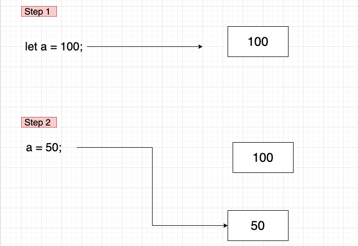
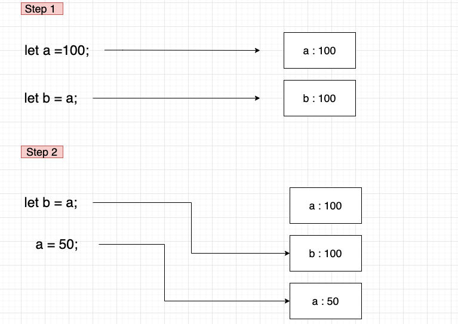

## Javascript의 변수 타입

Javascript의 변수 타입에는 크게 `Primitive type(원시타입)과 Reference Type(참조타입)`으로 나누어져 있습니다.  
`원시타입(Primitive type)`의 변수들은 데이터 복사가 일어날 때 메모리 공간을 새로 확보하여 독립적인 값을 저장하며, `참조 타입(Reference Type)`은 메모리에 직접 접근이 아닌 메모리의 위치(주소)에 대한 간접적인 참조를 통해 메모리에 접근하는 데이터 타입입니다.

## 값 타입(Value Type)

Javascript에서 **원시 타입 (String, Number, BigInt, Boolean, undefined, ES6 부터 추가된 Symbol)** 은 변수에 할당될 때, 메모리의 고정 크기로 원시 값을 저장하고 해당 저장된 값을 변수가 직접적으로 가리키는 형태를 띕니다.  
또한, 값이 절때 변하지않는 불변성을 갖고있기때문에 때문에 재할당 시 기존 값이 변하는것 처럼 보일지 몰라도 사실 새로운 메모리에 재할당한 값이 저장되고 변수가 가리키는 메모리가 달라졌을 뿐입니다.

<예제1>

```Javascript
let a = 100;
a = 50;
```



a란 변수에 100이란 값을 할당하고 2번째 라인에서 50으로 재할당을 해준 예시입니다.  
첫 라인이 실행되면 메모리에 `Number`타입의 100이란 값이 생성되고 식별자 a는 메모리에 생성된 100의 메모리 주소를 가리킵니다.  
그후 두번째 라인이 실행되면 이전 메모리에 생성된 100이란 값이 50으로 수정되는것이 아닌, 새로운 `Number`타입의 50이란 값을 새로운 메모리에 생성하고 a가 가리키던 메모리의 주소 값이 바뀌는것 입니다.

**즉, 메모리에는 100과 50이란 값이 모두 존재**하고 있으며, 앞에서 말했듯이 원시타입은 **불변성**을 갖고 있기 때문에 기존에 메모리에 생성된 값들은 그 자체가 변경될 수는 없습니다.  
그저 식별자와 연결 돼있는 메모리의 주소가 바뀌었기에 우리 눈에는 값이 재할당 된 것처럼 보이는 것입니다.

<예제2>

```Javascript
let a = 100;
let b = a;
a = 50;

console.log(b); // 100
```



새로운 변수 b에 a를 할당 하게되면 변수 b의 공간에는 a의 값을 값을 통째로 복사하여 변수의 메모리에 담게 됩니다.  
그렇기에 변수 a가 50으로 재할당 되더라도 b는 전혀 영향을 받지 않습니다.

## 참조 타입(Reference Type)

참조 타입은 변수에 할당할 때 값 타입처럼 값을 저장하는 것이 아닌 **주소**를 저장합니다.  
변수는 주소를 저장하고, 주소는 특별한 동적인 데이터 보관함에 보관됩니다.  
이 보관함은 `힙(Heap)`입니다. 만약, 값을 재할당 할 경우 주소를 참조한 모든 값이 영향을 받습니다.  
즉, 값이 공유되는 특성을 지니고 있습니다.

- Javascript에선 원시 자료형이 아닌 모든 것은 참조 자료형입니다.
- 참조형은 원시형 데이터의 집합입니다.
  배열([])과 객체({}), 함수(function(){})가 대표적입니다.
- 참조 자료형은 기존에 고정된 크기의 보관함이 아닙니다.  
  참조 자료형을 변수에 할당할 때는 변수에 값이 아닌 주소를 저장합니다.
- 동적으로 크기가 변하는 데이터를 보관하기위해 변수가 아닌 다른곳에 데이터를 저장하고 변수에는 그 주소만 할당됩니다.
- 배열(Array) - [0,1,2,3,4]
- 객체(Object) - {name : 'goong', age : 26}

**즉, 변수에는 하나의 값 혹은 주소만 저장할 수 있습니다.**

<예제>

```Javascript
let obj = {
  a: 1,
  b: 2,
  c: 3
};

let newObj = obj;

newObj.a = 100; // a에 값 100을 재할당

console.log(obj.a); // 100
console.log(newObj.a); // 100
// 두 객체는 동일한 주소를 참조하기 때문에 a값이 바뀌게 되고 반환되는 a의 값이 둘 다 변경됨.
```

## Summary

- 값 타입(Value Type)

  - 값에 의한 전달
  - 원시 타입값을 그대로 복사하며 데이터를 바꿔도 다른 데이터에 영향을 미치지 않음

- 참조 타입(Reference Type)
  - 참조에 의한 전달
  - 원시 타입을 제외한 모든 참조 타입
  - 객체의 메모리 주소를 복사하며 데이터를 바꾸면 참조하는 모두에게 영향을 미침

참고자료:

- https://velog.io/@nomadhash/Java-Script-%EA%B9%8A%EC%9D%80-%EB%B3%B5%EC%82%AC%EC%99%80-%EC%96%95%EC%9D%80-%EB%B3%B5%EC%82%AC
- https://comp-jae.tistory.com/103
