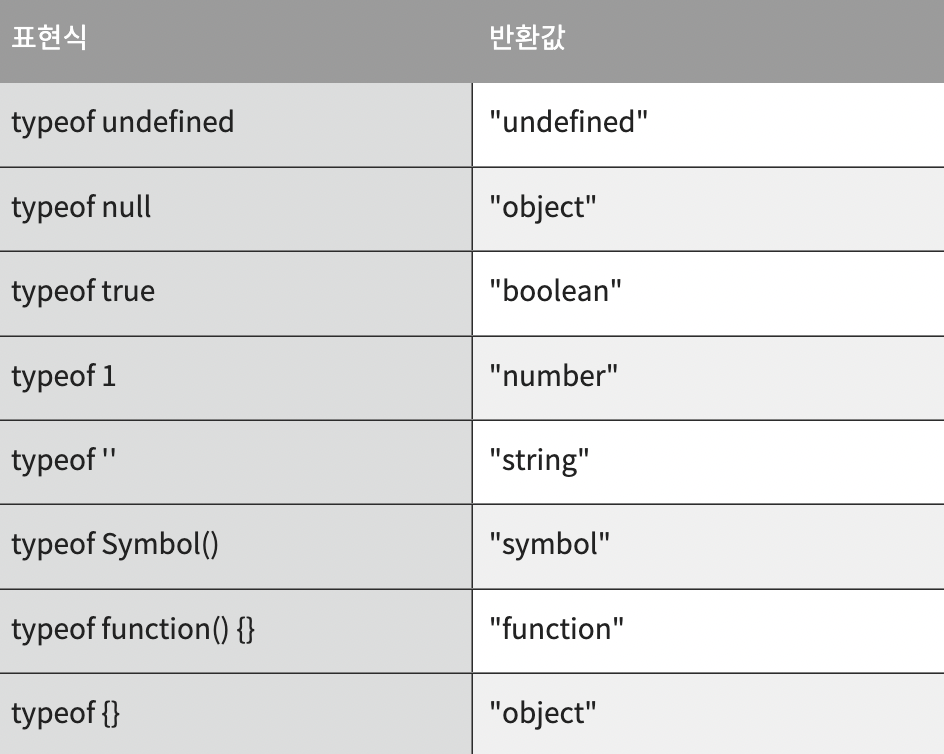
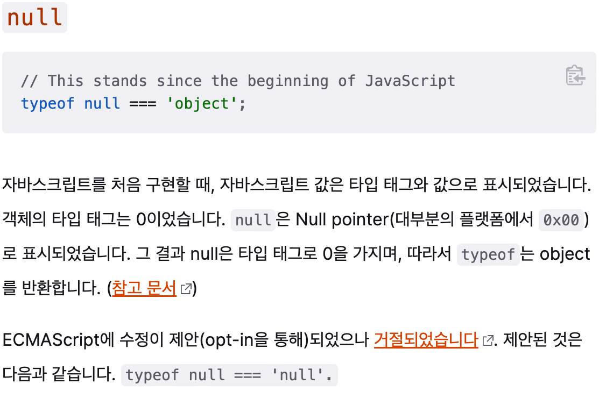

## --(Equal Operator, 이중등호, 동등연산자)

자바스크립트에서 동등연산자를 사용할 때는 두 변수의 값만 체크함. 값만 같다면 true가 반환됨.

<예제1>

```javascript
var a = 3;
var b = '3';
let c = 3;
a == b; // true
a == c; // true
b == c; // true
```

<예제2>

```javascript
✔ 0값은 false와 동일하므로 -> true 출력

0 == false // true

✔ 자동 유형변화 비교

2 == "2" // expected output: true
```

==(동등연산자)는 양 옆의 값을 비교하기 전에 강제 형 변환(Type Coercion)를 수행합니다. 강제 형변환 과정을 통해 피 연산자들을 공통 타입으로 만들고 그 안에 있는 값만을 비교하는, '느슨한 비교'를 합니다.

## ---(Strict Equal Operator, 삼중등호, 일치연산자)

자바스크립트에서 일치연산자를 사용할 때는 엄격히 동일한지를 체크함. 값이 같을뿐만 아니라, 유형(type)도 같아야함.

<예제1>

```javascript
5 === 5;
// true

'hello world' === 'hello world';
// true (둘 다 String, 동일한 값)
true === true;
// true (Booleans, 동일한 값)

77 === '77';
// false(Number vs String)

'cat' === 'dog';
// false(둘 다 String이지만 다른 값을 가짐)

false === 0;
// false(유형, 값이 모두 다름)
```

<예제 2>

```javascript
✔ 두 피연산자의 유형이 다르기 때문에 -> false
0 === false // expected output: false
console.log(typeof 0); 	// expected output: "number"
console.log(typeof false); // expected output: "boolean"

✔ 두 피연산자의 유형이 다르기 때문에 -> false

2 === "2" // expected output: false
console.log(typeof 2);	// expected output: "number"
console.log(typeof "2");  // expected output: "string"
```

===(일치연산자)는 ==(동등연산자)와 달리 강제 형변환 과정을 수행하지 않는 '엄격한 비교'를 수행함

## typeof

typeof 연산자는 undefined, null, boolean, number, string, symbol, object, function의 자바스크립트가 가진 7가지 변수 타입을 구분하는 용도로 사용함.



```javascript
console.log(typeof undeclaredVariable); // "undefined"
console.log(typeof null); // "object"
console.log(typeof true); // "boolean"
console.log(typeof 27); // "number"
console.log(typeof 'YD'); // "string"
console.log(typeof Symbol()); // "symbol"
console.log(typeof function () {}); // "function"
console.log(typeof {}); // "object"
```

### null은 왜 'object'인가?

typeof 연산자는 null을 "object"라고 판단합니다. null을 "object"로 반환하는 이유는 Mozilla에서는 이와 같이 이야기합니다.


### 배열도 'object'로 표현됨

```javascript
typeof [];
// 'object'
```

자바스크립트는 배열(array) 자료구조를 제공하지만, typeof는 배열(array)을 구분하지 못함. typeof []는 'object'를 반환함. typeof는 배열을 식별하지 못하기 때문에 배열을 구분하기 위해서는 Array.isArray()라는 다른 함수를 사용해야함. 이는 객체를 구체적으로 구분을 해야 하는 상황에서는 별도의 함수를 정의해서 사용해야 한다는 의미이기도 함

## Summary

- --: 두 변수의 [값]을 비교
- ---: 두 변수의 [값], [유형]을 모두 비교
- typeof: typeof 연산자는 자바스크립트가 가진 변수 타입을 구분하는 용도로 사용

출처: https://velog.io/@filoscoder/-%EC%99%80-%EC%9D%98-%EC%B0%A8%EC%9D%B4-oak1091tes,
https://all-dev-kang.tistory.com/entry/%EC%9E%90%EB%B0%94%EC%8A%A4%ED%81%AC%EB%A6%BD%ED%8A%B8-%EC%9D%98-%EC%B0%A8%EC%9D%B4%EC%97%90-%EB%8C%80%ED%95%B4%EC%84%9C, https://7942yongdae.tistory.com/71
